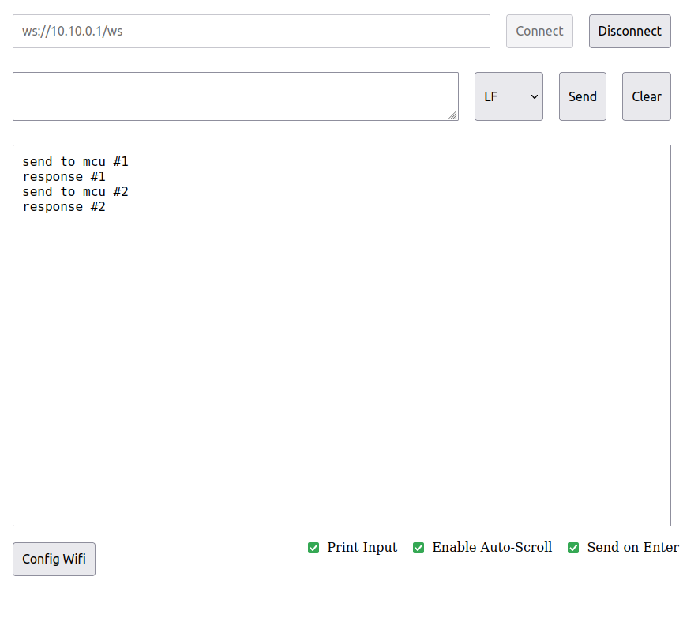
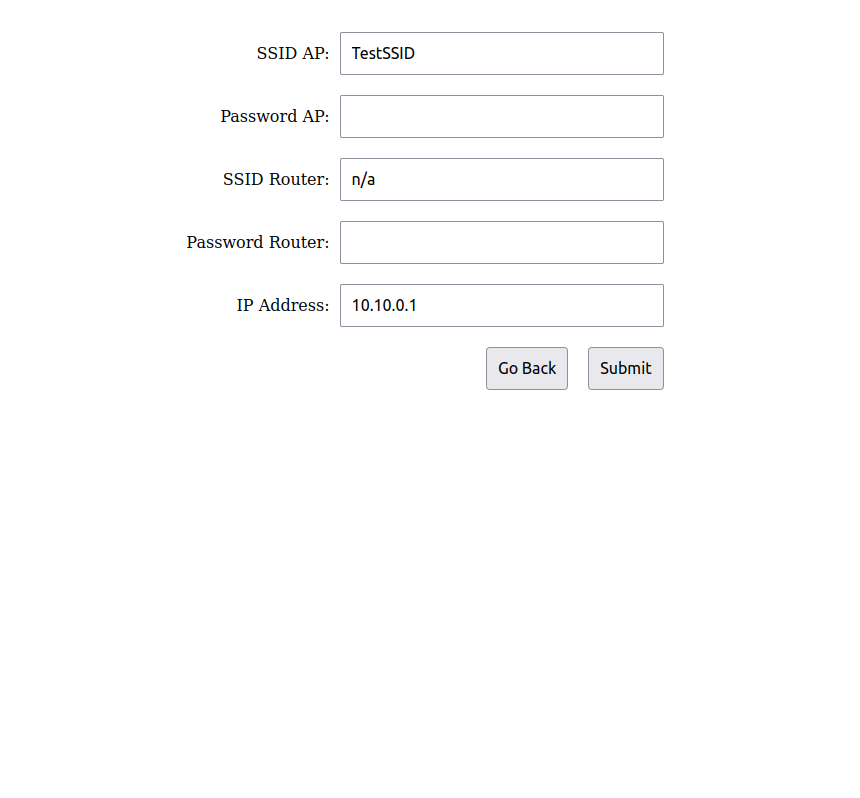

# ESP32-Wireless-Serial-Web-Interface

## Overview

Transform your projects into wireless solutions effortlessly with the ESP32 web serial interface. By leveraging a web-based UI, the ESP32 connects seamlessly to an existing project's serial interface, functioning just like the familiar Arduino serial monitor to facilitate two-way communication over the serial interface wirelessly.

The ESP32 serves a sleek web page that displays a simple and intuitive UI, using WebSockets to send and receive messages. These messages are forwarded to a serial interface, configurable directly in the code.

## Features

- **Wireless Communication**: Make your projects wireless with ease, connecting to serial interfaces over Wi-Fi.
- **User-Friendly Web UI**: Interact with your projects through a web interface that mimics the Arduino serial monitor.
- **WebSocket Connectivity**: Utilize WebSockets for efficient, real-time communication between the web interface and the ESP32.
- **Wi-Fi Configuration**: A built-in form allows you to set Wi-Fi SSID, AP SSID, passwords, and IP addresses for AP mode, offering convenience and flexibility.
- **Custom WebSocket URLs**: Connect to external WebSocket services by entering a custom URL.


*Web Serial Interface*

## Technical Details

- **Web Interface**: The web page is served by the ESP32 and built using Vite, with all scripts and CSS embedded, ensuring a streamlined user experience.

## Benefits

- **Convenience**: Easily configure and manage Wi-Fi settings directly from the web interface.
- **Versatility**: Can be used with many projects or for wireless debugging.
- **Simplicity**: With Vite, the static HTML page is straightforward and easy to use, eliminating the need for complex setup.


*Wi-Fi Configuration Form*

---

## Build and Usage

This project is built using PlatformIO and can be used on any ESP32 device. By default, it uses the Serial 2 interface. Only two pins are needed for data (RX2 and TX2) and two for power.

### Pre-built Vite Web Page

A pre-built version of the Vite web page is included. If you need to build a custom version, you can use the provided script `compile_page_bytes.sh`. The script allows you to enable various options by uncommenting specific lines.

### Custom-built Vite Web Page

cd into the `./js-src/` directory and use 

```bash
npm install
``` 

to install the dependencies.

### Script: `compile_page_bytes.sh`

To customize and build the Vite web page, follow these steps:

1. **Navigate to the Project Root Directory**: Make sure you are in the root directory of the project.
2. **Modify the Script**: Open `compile_page_bytes.sh` and uncomment the desired options. The available options include:

   - **`VITE_APP_PRINT_INPUT`**: Print the input in the output box by default. This allows you to see the data you are sending through the serial interface in the web UI output box.
   
   - **`VITE_APP_NEWLINES_SEPARATOR`**: Set the default selection for the CR/CRLF/NONE menu. Options can be:
     - `empty` (no separator)
     - `\\n` (newline)
     - `\\n\\r` (carriage return + newline)

   - **`VITE_APP_HIDE_NEWLINE_SEPARATOR_MENU`**: Include the menu for selecting CR/CRLF/NONE in the UI. This provides flexibility in configuring how newline characters are handled.

   - **`VITE_APP_WIFI_CONFIG`**: Enable the Wi-Fi configuration button and form in the web UI. This makes it easy to set or change Wi-Fi settings directly from the web interface.

   - **`VITE_APP_AUTORECONNECT_SOCKETS`**: Automatically reconnects if the WebSocket connection dies. This ensures persistent connectivity without manual intervention.

   - **`VITE_APP_WIFI_CONFIG_DEFAULT_HOST`**: Set the default hostname for the ESP32 Wi-Fi configuration. For example, `http://192.168.0.1`.

   - **`VITE_APP_DEFAULT_URL`**: Set the default WebSocket URL. For example, `ws://192.168.0.1/ws`. This URL is used to establish the WebSocket connection.

   - **`VITE_APP_START_CONNECTED_SOCKETS`**: Start the WebSocket connection on page load. This means the connection will be established automatically when the web page is loaded.

   - **`VITE_APP_INCLUDE_CONNECTION_URL`**: Include the connection URL input in the UI. This allows users to manually enter the WebSocket URL if the default is not suitable.

   - **`COMPRESSION_ENABLED`**: Enable GZ compression for the HTML file. This reduces the size of the HTML file, improving load times and performance.

3. **Run the Script**: Execute the script to build the Vite web page from the root directory of the project:
   ```bash
   ./compile_page_bytes.sh
   ```

The script will build the Vite web page and convert it to a format suitable for the ESP32, storing the result in `src/index.h`.

For more details, refer to the script [`compile_page_bytes.sh`](./compile_page_bytes.sh).

---

Elevate your projects with the ESP32 web serial interface, blending simplicity, flexibility, and powerful wireless communication in a single solution.